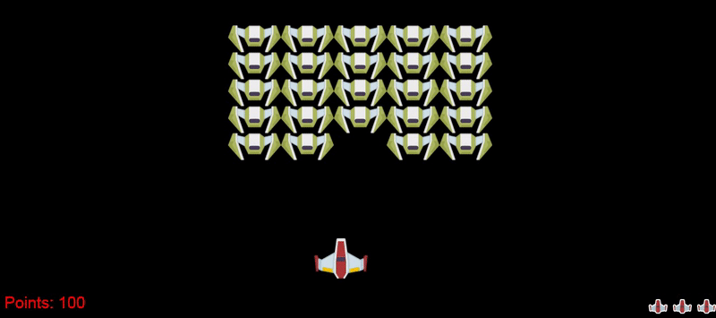

# Space-Invaders-js

Space invaders browser game that I started as part of a JavaScript course and then improved a bit.

## Live version

Check out the live version [here!](https://space-invaders-js.netlify.app/)

### Controls

Move the ship with the arrows.

Fire with `a`.

## Contributing 🖇️

Any contributions are highly appreciated. Read the [contributing guidelines](https://github.com/Uklizdev/Space-Invaders-js/blob/master/CONTRIBUTING.md) for more info!

## License 📄

This project is [MIT](https://choosealicense.com/licenses/mit/) licenced

⌨️ with ❤️ by [Ukliz](https://github.com/Uklizdev) 😊
